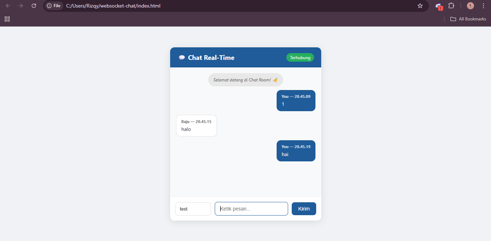
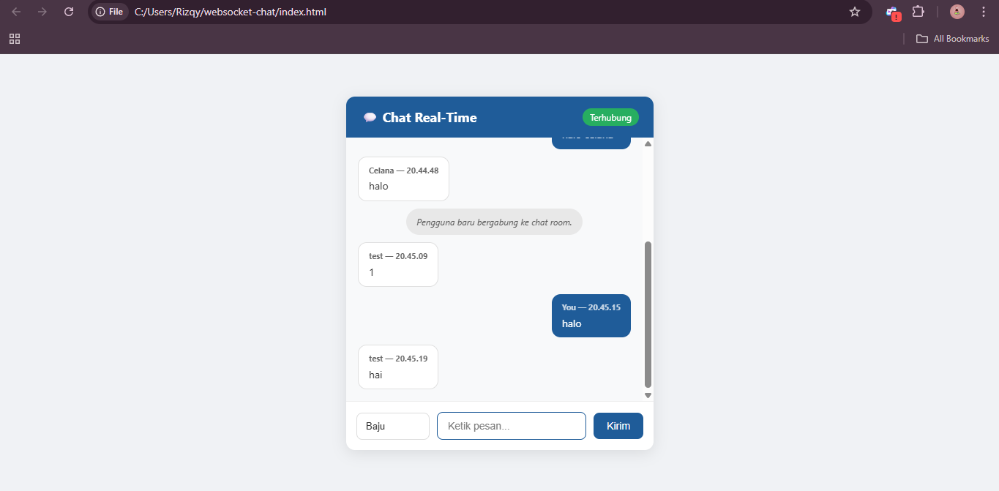

# 💬 WebSocket Chat Real-Time

> Eksperimen aplikasi chat real-time menggunakan protokol WebSocket — Tugas UTS Pemrograman Web

---

## 📌 Deskripsi Proyek

Proyek ini merupakan implementasi sederhana dari protokol **WebSocket** untuk membangun aplikasi chat real-time. Berbeda dengan HTTP tradisional yang bersifat *request-response*, WebSocket memungkinkan komunikasi dua arah (*full-duplex*) antara klien dan server dalam satu koneksi yang persisten.

Proyek ini dibuat sebagai bagian dari **Tugas UTS mata kuliah Pemrograman Web**, dengan tujuan memahami cara kerja WebSocket secara langsung melalui eksperimen nyata.

---

## 🖼️ Screenshot Hasil Eksperimen

### Tab 1 — Pengguna test


### Tab 2 — Pengguna Baju


> **Catatan:** Kedua tab di atas berjalan di browser yang sama secara bersamaan, membuktikan bahwa pesan terkirim secara instan tanpa perlu me-refresh halaman.

---

## 🧪 Hasil Eksperimen

Dari eksperimen yang dilakukan, diperoleh hasil sebagai berikut:

| Aspek | Hasil |
|---|---|
| Latensi pengiriman pesan | < 10ms (jaringan lokal) |
| Jumlah klien yang bisa terhubung | Tidak terbatas (dibatasi RAM server) |
| Refresh halaman diperlukan? | ❌ Tidak perlu |
| Overhead per pesan | Sangat kecil (header WebSocket ~2–10 byte) |
| Deteksi klien disconnect | ✅ Otomatis terdeteksi |

---

## 🛠️ Teknologi yang Digunakan

- **Node.js** — Runtime JavaScript untuk server
- **ws** — Library WebSocket untuk Node.js
- **HTML/CSS/JavaScript** — Antarmuka pengguna (klien)

---

## 📁 Struktur Proyek

```
websocket-chat/
├── server.js       # Server WebSocket (Node.js)
├── index.html      # Antarmuka chat di browser
├── package.json    # Konfigurasi proyek & dependency
├── README.md       # Dokumentasi proyek ini
```

---

## 🚀 Cara Menjalankan

### Prasyarat
Pastikan **Node.js** sudah terinstall di komputer kamu.
Download: https://nodejs.org

### Langkah-langkah

**1. Clone atau download proyek ini**
```bash
git clone https://github.com/username/websocket-chat.git
cd websocket-chat
```

**2. Install dependency**
```bash
npm install
```

**3. Jalankan server**
```bash
node server.js
```

Output yang muncul:
```
✅ Server WebSocket berjalan di ws://localhost:8080
```

**4. Buka klien di browser**

Buka file `index.html` langsung di browser (double-click), atau gunakan Live Server jika memakai VS Code.

**5. Uji komunikasi real-time**

Buka `index.html` di **dua tab browser berbeda**, isi nama yang berbeda di masing-masing tab, lalu kirim pesan. Pesan akan muncul secara instan di kedua tab!

---

## ⚙️ Cara Kerja

```
Tab Browser A                    Server Node.js               Tab Browser B
(Alice)                         (ws://localhost:8080)          (Bob)
   |                                    |                          |
   |--- WebSocket Handshake ----------->|                          |
   |<-- 101 Switching Protocols --------|                          |
   |                                    |<-- WebSocket Handshake --|
   |                                    |--- 101 Switching ------->|
   |                                    |                          |
   |--- "Halo Bob!" ------------------>|                          |
   |                                    |--- "Halo Bob!" --------->|
   |                                    |                          |
   |<-----------------------------------|<-- "Hai Alice!" ---------|
   |                                    |                          |
```

1. Setiap klien membuka koneksi WebSocket ke server melalui proses **handshake**
2. Server menyimpan semua koneksi aktif dalam sebuah `Set`
3. Saat pesan diterima dari satu klien, server **mem-broadcast** ke semua klien yang terhubung
4. Koneksi tetap terbuka — tidak ada overhead HTTP berulang

---

## 📚 Referensi

- [RFC 6455 — The WebSocket Protocol](https://datatracker.ietf.org/doc/html/rfc6455)
- [MDN Web Docs — WebSocket API](https://developer.mozilla.org/en-US/docs/Web/API/WebSocket)
- [npm: ws — WebSocket library](https://www.npmjs.com/package/ws)
- [WHATWG — HTML Living Standard: Web Sockets](https://html.spec.whatwg.org/multipage/web-sockets.html)

---

## 👤 Informasi Tugas

| | |
|---|---|
| **Mata Kuliah** | Pemrograman Web |
| **Tugas** | UTS — Menulis Artikel untuk Publikasi Online |
| **Topik** | WebSocket |
| **Publikasi** | [Baca artikel di Medium](https://medium.com/@rizkial347/websocket-teknologi-di-balik-aplikasi-web-real-time-e560f727d28f) |

---

> Dibuat dengan tujuan pembelajaran — Tugas UTS Pemrograman Web
